# Databricks Auto Loader Bronze-to-Silver Orders Pipeline

A Databricks project that incrementally ingests order CSV files with Auto Loader into a Bronze Delta table, reads Bronze incrementally into a Silver validation and upsert flow, writes rejected rows to a separate table, and creates a Gold daily revenue summary.

## summary

> I built an incremental Databricks Medallion pipeline using Auto Loader, Structured Streaming, and Delta Lake. CSV order files are ingested into a Bronze Delta table with source-file lineage. Silver reads Bronze incrementally as a stream, so after the initial load it processes only new Bronze commits using its own checkpoint. Inside `foreachBatch`, I normalize region values, safely cast amounts and dates, validate records, and use Delta `MERGE` to upsert valid orders by `order_id`. Excluded rows are written to a rejected table, while a Gold table aggregates daily order volume and revenue by region. The use of `availableNow=True` makes the pipeline appropriate for a scheduled Databricks Job.

## Technologies

- Databricks
- Apache Spark / PySpark
- Spark Structured Streaming
- Databricks Auto Loader (`cloudFiles`)
- Delta Lake
- Unity Catalog Volumes
- Databricks SQL


## Architecture

```mermaid
flowchart LR
    A["CSV files\nworkspace.default.book_data Volume"] --> B["Auto Loader\ncloudFiles CSV source"]
    B --> C["Bronze query\nappend + availableNow"]
    C --> D["workspace.first_project_autoload.orders_bronze"]
    D --> E["Silver source\nspark.readStream.table"]
    E --> F["foreachBatch\ncast, validate, deduplicate"]
    F -->|"Valid"| G["MERGE by order_id"]
    G --> H["workspace.first_project_autoload.orders_silver"]
    F -->|"Excluded by order_id"| I["Append"]
    I --> J["workspace.first_project_autoload.orders_rejected"]
    H --> K["Gold SQL aggregation"]
    K --> L["workspace.first_project_autoload.revenue_by_region_day"]
```



## What the notebook implements

### 1. Provision Databricks objects

The first SQL cell creates the project schema and the Unity Catalog Volumes used for input files, schema state, and checkpoints:

```sql
CREATE SCHEMA IF NOT EXISTS workspace.first_project_autoload;
CREATE VOLUME IF NOT EXISTS workspace.default.book_data;
CREATE VOLUME IF NOT EXISTS workspace.default.schema;
CREATE VOLUME IF NOT EXISTS workspace.default.checkpoints;
```

CSV files are uploaded to the `workspace.default.book_data` Volume.

The same cell creates the Silver Delta table when it does not already exist:

```sql
CREATE TABLE IF NOT EXISTS workspace.first_project_autoload.orders_silver (
    order_id STRING,
    customer_id STRING,
    product STRING,
    region STRING,
    quantity INT,
    amount DOUBLE,
    order_date DATE,
    status STRING
)
USING DELTA;
```

### 2. Ingest files to Bronze with Auto Loader

The notebook reads CSV files with Auto Loader:

```python
bronze_stream = (
    spark.readStream
    .format("cloudFiles")
    .option("cloudFiles.format", "csv")
    .option("header", "true")
    .option(
        "cloudFiles.schemaLocation",
        "/Volumes/workspace/default/schema/orders/"
    )
    .load("/Volumes/workspace/default/book_data/")
)
```

It adds data-lineage fields before writing to Bronze:

```python
bronze_stream = (
    bronze_stream
    .withColumn("source_file", F.col("_metadata.file_path"))
    .withColumn("loaded_at", F.current_timestamp())
)
```

| Column | Purpose |
|---|---|
| `source_file` | Full source path supplied by Auto Loader metadata. |
| `loaded_at` | Timestamp when Spark processed the record. |

The Bronze stream appends to a Delta table:

```python
query = (
    bronze_stream.writeStream
    .format("delta")
    .outputMode("append")
    .option(
        "checkpointLocation",
        "/Volumes/workspace/default/checkpoints/bronze/orders/"
    )
    .trigger(availableNow=True)
    .toTable("workspace.first_project_autoload.orders_bronze")
)

query.awaitTermination()
```

`availableNow=True` processes files available when the query starts and then stops. The Bronze checkpoint retains file-ingestion progress across runs, while `awaitTermination()` prevents the notebook task from ending early.

### 3. Stream Bronze incrementally to Silver

Silver uses the Bronze Delta table as its streaming source:

```python
silver_source = spark.readStream.table(
    "workspace.first_project_autoload.orders_bronze"
)
```

With the persistent Silver checkpoint, the first run processes existing Bronze data; later runs process only new committed Bronze records. It does not re-read the full Bronze table on every scheduled run.

### 4. Transform and validate each Silver micro-batch

The `process_batch` function standardizes fields:

```python
typed_df = batch_df.withColumns({
    "region": F.initcap(F.trim(F.col("region"))),
    "amount": F.expr("try_cast(amount AS DOUBLE)"),
    "order_date": F.expr("try_cast(order_date AS DATE)")
})
```

- `region` is trimmed and converted to title case.
- `amount` is safely cast to `DOUBLE`.
- `order_date` is safely cast to `DATE`.
- Invalid casts become `NULL` instead of failing the stream.

The validation condition implemented in the notebook is:

```python
is_valid = (
    F.col("amount").isNotNull()
    & (F.col("amount") >= 0)
    & F.col("order_date").isNotNull()
)
```

Valid rows are selected to the Silver target schema and deduplicated within the micro-batch:

```python
clean_df = (
    typed_df.filter(is_valid)
    .select(
        "order_id", "customer_id", "product", "region",
        "quantity", "amount", "order_date", "status"
    )
    .dropDuplicates(["order_id"])
)
```

The current validation checks `amount` and `order_date`. The notebook selects `quantity` for Silver but does not explicitly cast or validate it in `process_batch`.

### 5. Upsert valid orders into Silver

The Silver target is accessed as a Delta table and merged using `order_id`:

```python
silver_table = DeltaTable.forName(
    spark,
    "workspace.first_project_autoload.orders_silver"
)

(
    silver_table.alias("target")
    .merge(clean_df.alias("source"), "target.order_id = source.order_id")
    .whenMatchedUpdateAll()
    .whenNotMatchedInsertAll()
    .execute()
)
```

A matching `order_id` updates the existing target row; a new `order_id` is inserted.

### 6. Write excluded rows to the rejected table

The notebook currently derives rejected rows using a left anti join:

```python
rejected_df = batch_df.join(
    clean_df,
    on="order_id",
    how="left_anti"
)

rejected_df.write.mode("append").saveAsTable(
    "workspace.first_project_autoload.orders_rejected"
)
```

This means the rejected table receives rows from the Bronze micro-batch whose `order_id` is absent from the valid, deduplicated `clean_df`. This is key-based behavior, not only `typed_df.filter(~is_valid)`.

### 7. Run the Silver stream

```python
query = (
    silver_source.writeStream
    .foreachBatch(process_batch)
    .option(
        "checkpointLocation",
        "/Volumes/workspace/default/checkpoints/silver/orders/"
    )
    .trigger(availableNow=True)
    .start()
)

query.awaitTermination()
```

The Silver checkpoint is distinct from the Bronze checkpoint. It records the Bronze Delta versions and micro-batches already processed by this downstream query.

### 8. Create the Gold aggregate

```sql
CREATE OR REPLACE TABLE workspace.first_project_autoload.revenue_by_region_day AS
SELECT
  region,
  order_date,
  COUNT(*) AS order_count,
  CAST(ROUND(SUM(amount), 2) AS DECIMAL(18,2)) AS total_revenue
FROM workspace.first_project_autoload.orders_silver
GROUP BY region, order_date;
```

The Gold table provides daily order count and revenue by region. `total_revenue` is rounded and stored as `DECIMAL(18,2)`.

## Data products

| Layer | Table | Write pattern | Purpose |
|---|---|---|---|
| Bronze | `workspace.first_project_autoload.orders_bronze` | Streaming Delta append | Raw Auto Loader records plus file and load-time lineage. |
| Silver | `workspace.first_project_autoload.orders_silver` | Delta `MERGE` on `order_id` | Standardized, validated order records. |
| Rejected | `workspace.first_project_autoload.orders_rejected` | Append | Bronze rows excluded from the valid batch by order ID. |
| Gold | `workspace.first_project_autoload.revenue_by_region_day` | `CREATE OR REPLACE TABLE` | Daily regional order count and revenue. |

## State management and monitoring

| State | Path | Role |
|---|---|---|
| Auto Loader schema | `/Volumes/workspace/default/schema/orders/` | Persists inferred source schema. |
| Bronze checkpoint | `/Volumes/workspace/default/checkpoints/bronze/orders/` | Tracks file ingestion progress. |
| Silver checkpoint | `/Volumes/workspace/default/checkpoints/silver/orders/` | Tracks downstream reads from the Bronze Delta table. |

The notebook includes a processed-file check for the Bronze Auto Loader checkpoint:

```sql
SELECT
  substring_index(path, '/', -1) AS Processed_file_names
FROM cloud_files_state(
  '/Volumes/workspace/default/checkpoints/bronze/orders/'
);
```

## How to run

1. Import `First_Project_with_Autoload.ipynb` into Databricks.
2. Attach compute with permission to use the `workspace` catalog and create schemas, Volumes, and Delta tables.
3. Run the provisioning cell. It creates the Silver target only if it does not already exist.
4. Upload new CSV files to `workspace.default.book_data`.
5. Run the Bronze ingestion cell and wait for it to finish.
6. Run the Silver streaming cell and wait for it to finish.
7. Run the Gold aggregation cell.
8. Use the notebook's SQL inspection cells to review Bronze, Silver, rejected rows, Gold output, and processed input files.

## Scheduling

It is designed for scheduled execution because both streams use `availableNow=True` and `awaitTermination()`. Schedule the ingestion and downstream processing externally, preserve all state paths across runs.

## repository layout

```text
.
├── First_Project_with_Autoload.ipynb
├── First_Project_with_Autoload.dbc
├── README.md
├── data/                 # sample CSVs
```
